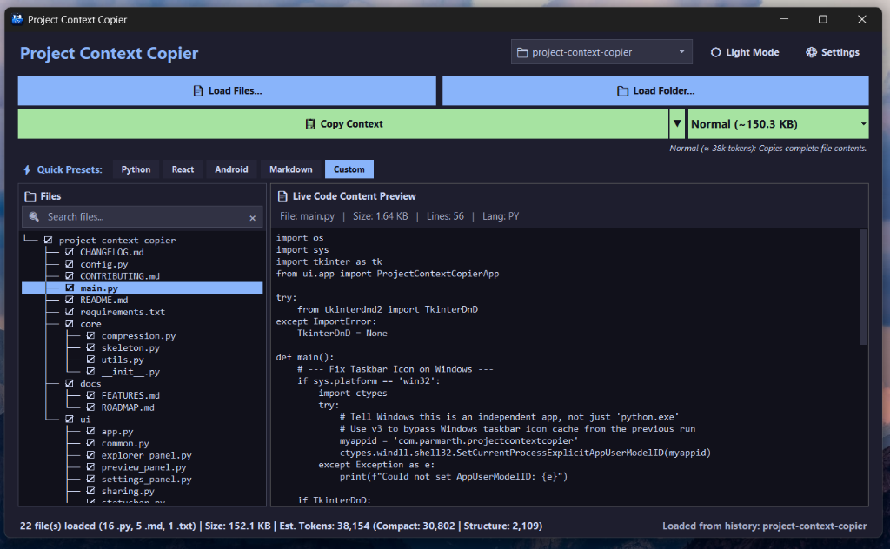
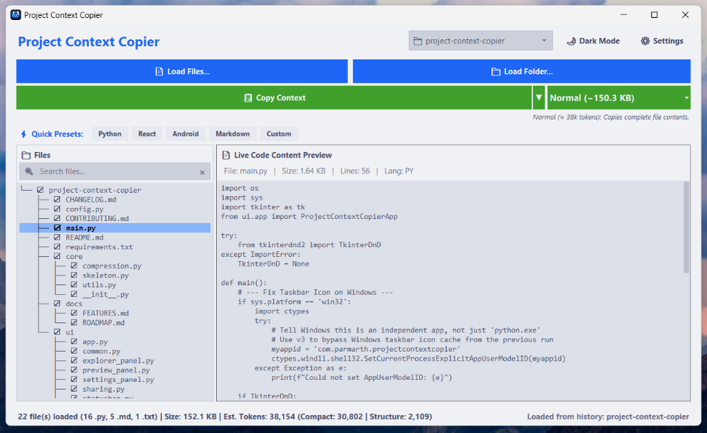
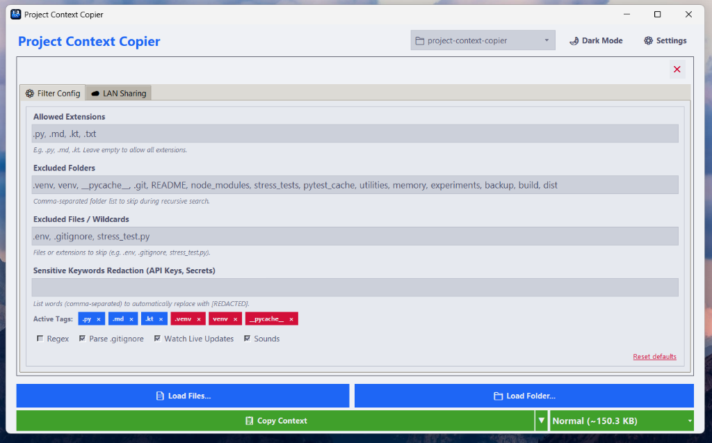

# Project Context Copier

> Build, compress, and copy project context in a clean, shareable format.

      

---

## Overview

Project Context Copier is a desktop utility that prepares source code for sharing, review, and faster handoff.

Instead of manually copying dozens of files, the application automatically:

- Loads an entire project
- Filters unnecessary files
- Removes comments
- Generates compact skeletons
- Creates Mermaid project graphs
- Includes Git changes
- Packages everything into one optimized context
- Copies directly to your clipboard

It is designed to keep project context organized, concise, and ready to use.

---


## Quick Links
- [Detailed Features List](docs/FEATURES.md)
- [Changelog](CHANGELOG.md)
- [Development Roadmap](docs/ROADMAP.md)
- [Contributing & Building from Source](CONTRIBUTING.md)

---

# Screenshots

Main application views:







---

# Installation

## Download

Download the latest executable from the [GitHub Releases page](releases).

No Python installation is required.

---

## Run

Simply launch

```
ProjectContextCopier-Windows.exe
```

---

# Requirements

- Windows 10/11
- Python 3.10+

---

# Why this project?

Project Context Copier automates context preparation by producing a clean, compact, and structured representation of your codebase.

---

# License

This project is licensed under the [MIT License](LICENSE).

---

# Author

Developed by Parth
